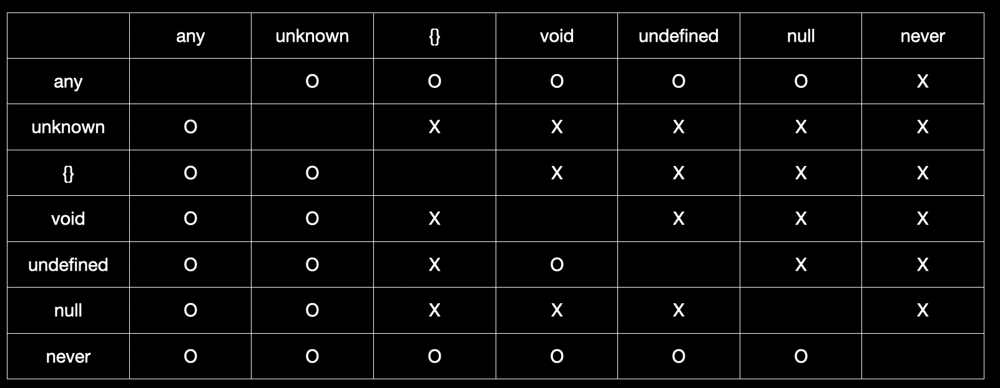

# 1주차 스터디 내용 정리
> #### info::출처
> 
> 이 내용은 [타입스크립트 교과서](https://product.kyobobook.co.kr/detail/S000208416779) 책을 읽고 스터디한 내용을 바탕으로 정리했습니다.

## 2.1 변수, 매개변수, 반환값에 타입을 붙이면 된다

타입스크립트는 변수와 함수의 매개변수, 반환값에 타입을 부여하고 이렇게 타입을 부여하는 행위를 타이핑이라고 합니다.

기본 타입으로는 string, number, boolean, null, undefined, symbol, bigint, object가 있고, 함수와 배열은 객체이므로 object에 포함됩니다.

- **변수에 타입을 붙이는 방법**
    
    ```tsx
    const str: string = 'hello';
    const num: number = 123;
    .
    .
    ```
    
- **함수에 타입을 붙이는 방법**
    
    ```tsx
    function plus(x:number, y:number): number {
    	return x + y;
    }
    
    const minus = (x: number, y: number): number => x-y;
    ```
    

## 2.2 타입 추론을 적극 활용하자

```tsx
function plus(x:number, y:number): number {
	return x + y;
}

const result1: number = plus(1, 2);
const result2 = plus(1, 2);
```

plus 함수의 반환값을 result1 변수에 대입했을 때, plus 함수의 반환값이 숫자이므로 result1의 타입을 number로 지정했습니다.

하지만 result2의 경우 타입을 지정하지 않았습니다. 그 이유는 타입스크립트가 알아서 result2의 타입을 추론하기 때문입니다. IDLE에서 result2 변수 위에 마우스 커서를 올려보면 타입이 number로 추론된 것을 확인할 수 있습니다.

```tsx
function plus(x, y) {
	return x + y;
}
```

다만 매개변수에는 타입을 부여해야합니다. 왜냐하면 어떤 값이 매개변수로 들어올지 알 수 없기 때문입니다. 매개변수에 타입을 명시하지 매개변수의 타입은 any타입으로 추론됩니다. 이렇게 사용자가 입력하지 않은 타입을 타입스크립트가 암묵적으로 any타입으로 추론하게되면 **`implicitAny`** 에러가 발생합니다.

- **const 변수의 타입 추론**
    
    ```tsx
    const str = 'hello'; //type = 'hello'
    const num = 123; //type = 123
    const bool = false; //type = flase
    const n = null; //type = null
    const u = undefined; //type = undefined
    const sym = Symbol('sym'); //type = typeof sym
    const big = 100000000000n; //type = 100000000000n
    const obj = { hello: 'world' } //type { hello: string }
    ```
    
    num이나 bool의 경우 number, bool으로 타입이 추론될 것이라고 예상했지만 전혀 다르게 추론됩니다. 그 이유는 const 변수이기때문에 다른 값이 들어올 수 없기 때문입니다. 타입스크립트에서는 123, false와 같은 정확한 값을 타입으로 쓸 수 있는데 이를 리터럴 타입이라고 부릅니다.
    
    - `typeof sym` 은 고유한 symbol, 즉 unique symbol을 의미하고 unique symbol끼리는 서로 비교할 수 없다
        - unique symbol과 일반 symbol, 일반 symbol과 일반 symbol은 비교 가능
        - `This comparision appears to be unintentional because th types 'typeof sym1' and typeof sym2' have no overlap`
    
    타입스크립트에서는 아래 예시와 같이 타입을 실제 타입보다 더 넓게 기입해도 문제가 없습니다.
    
    ```tsx
    const str: 'hello' = 'hello';
    const str2: string = 'hello';
    const str3: {} = 'hello';
    ```
    
    때문에 타입스크립트가 타입을 제대로 추론하는 경우 개발자가 직접 타입을 입력하는 것 보다 그대로 두는 것이 더 정확합니다.

    > #### default::(J088) 타입 작성 유형, (J127) 타입을 언제 저렇게 작성할지
    > 
    >    
    >   진짜 상수로 사용하는 것 예를 들어 절대 안바뀌는 값들을 주로 사용할 때
    >   
    >   ```tsx
    >   const KAKAO_AUTH: string = “ASFKLNANSFLK";
    >   const KAKAO_AUTH: "KAKAO_AUTH" = “KAKAO_AUTH";
    >   
    >   // 이런 절대 안바뀔 값의 경우에는 이렇게 진짜 전용 타입을 만들어주면 되고 
    >   // 이런게 아닌 이상은 그냥 string을 사용할 것 같은데 어떻게 생각하는지
    
- **let 변수의 타입 추론**
    
    ```tsx
    let str = 'hello'; //type = string
    let num = 123; //type = number
    let bool = false; //type = boolean
    let n = null; //type = any
    let u = undefined; //type = any
    let sym = Symbol('sym'); //type = symbol
    let big = 100000000000n; //type = bigint
    let obj = { hello: 'world' } //type { hellog: string }
    ```
    
    let으로 선언한 변수는 다른 값을 대입할 수 있기 때문에 타입을 넓게 추론합니다. 이러한 현상을 타입 넓히기라고 부릅니다. 하지만 자료형을 변경하는 경우는 그리 많지 않기 때문에 처음에 입력한 값의 타입을 기반으로 추론합니다.
    
    기억해야할 것은 null과 undefind을 let변수에 대입할 때는 타입을 any로 추론한다는 것입니다.
    
    > #### info::타입스크립트 에러를 무시하는 방법
    > 
    > ``tsx
    > // @ts-ignore
    >```
    > 위 주석을 사용해서 타입스크립트 에러를 무시할 수 있습니다. 하지만 이 방법은 임시방편으로 사용하도록 하고 올바른 타입스크립트 코드를 작성하는 것을 권장합니다.
    > ```tsx
    > // @ts-expect-error
    > ```
    > 위 주석으로도 타입스크립트 에러를 무시할 수 있습니다. `@ts-ignore` 주석은 다음 줄의 코드가 올바른 코드이든 아니든 에러가 난다면 무시하지만, 이 주석은 다음 줄의 코드가 반드시 에러가 나지만 무시하겠다는 뜻입니다. 그래서 다음 줄의 코드가 정상적인 코드라면 반대로 에러가 발생합니다.
    > `@ts-expect-error`를 사용하는 것이 다음 줄의 코드에 확실히 에러가 있다는 것을 알리기 때문에 더 낫다 


## 2.3 값 자체가 타입인 리터럴 타입이 있다

위에서 const변수에 문자열 값을 대입하고 타입을 명시하지 않았을 때 변수의 타입이 문자열 자체로 추론되는 것을 볼 수 있었습니다. 이를 리터럴 타입이라고 합니다.

리터럴 타입은 주로 const 변수와 함께 사용됩니다. 만약 let변수에 리터럴 타입을 사용한다면 값을 변경할 수 없습니다.

```tsx
let str: 'hello' = 'hello';
str = 'world';
// Type 'world' is not assignable to type 'hello'.
```

원시 자료형 이외에도 객체나 함수에도 리터럴 타입을 사용할 수 있습니다.

```tsx
const obj: { name: 'zero' } = { name: 'zero' };
const arr: [ 1, 3, 'five' ] = [ 1, 3, 'five' ];
const func: (amount: number, unit: string) => string
	= (amount, unit) => amount + unit;
```

함수의 리터럴 타입을 표기할때는 콜론 대신 ⇒를 사용합니다. 함수에 리터럴 타입으로 타입을 표기한다면 실제 매개변수에는 타입 표기를 생략해도 됩니다.

하지만 객체 리터럴 타입을 사용할 때 대부분의 경우 타입스크립트는 우리가 의도한 것 보다 부정확하게 타입을 추론합니다. 아래 코드가 그 예시입니다.

```tsx
const obj = { name: 'zero' };
// const obj: { name: string }
```

자바스크립트의 객체는 const 변수라도 내부의 값은 수정할 수 있으므로, 타입스크립트는 수정 가능성을 염두해두고 타입을 넓게 추론합니다. 만약 값이 변하지 않는 것이 확실하다면 `as const` 라는 특별한 접미사를 붙이면 됩니다.

```tsx
const obj = { name: 'zero' } as const;
// const obj: { readonly name: 'zero' }
```

`as const` 접미사를 붙이면 obj 속성 앞에 readonly라는 수식어가 붙고 타입이 고정되어 추론됩니다.

## 2.4 배열 말고 튜플도 있다

- **배열의 타이핑**
    
    ```tsx
    const arr1: string[] = ['1','2','3'];
    const arr2: Array<number> = [1,2,3];
    ```
    
    **타입[]** 또는 **Array<타입>** 으로 타이핑하면 됩니다.
    
- **배열 추론의 한계**
    
    ```tsx
    const array = [123, 4, 56];
    array[3].toFixed();
    ```
    
    `array[3]`은 존재하지 않아 undefined인데 toFixed 메소드를 사용해도 컴파일 에러 발생하지 않음
    
    → 튜플을 사용하여 해결할 수 있음
    
- **튜플의 타이핑**
    
    ```tsx
    const tuple: [number, boolean, string] = [1, false, 'hi'];
    ```
    
    각 요소 자리에 타입이 고정되어 있는 배열을 튜플이라고 부릅니다. 
    튜플은 위와 같이 타이핑 할 수 있습니다.
    
    튜플로 타이핑하게 되면 각 자리에는 직접 표기한 타입만 대입할 수 있습니다. 그리고 타입이 표기되지 않은 인덱스에 접근하려고 하면 해당 인덱스에는 요소가 없다는 에러 메시지가 표시됩니다. (표기하지 않은 세 번째 인덱스부터는 undefined 타입으로 추론됨)
    
    주의할점은 push, pop, unshift, shift같은 배열에 요소를 추가하거나 제거하는 동작은 막지 않는다는 것입니다. 왜냐하면 배열에 추가된 값은 타입이 명시되지 않은 인덱스를 할당받기 때문에 접근할 수 없기 때문입니다. 위와 같은 배열 메서드 동작까지 막으려면 타입 앞에 readonly 수식어를 붙여주어야 합니다.
    
    ```tsx
    const tuple: readonly [number, boolean, string] = [1, false, 'hi'];
    tuple.push('no');
    ```

    > #### info::pop이나 shift같은 제거 연산은 어떨까?
    > 
    > pop으로 튜플의 요소를 제거했을때는 배열 안에 값은 없지만, 타입은 명시 되어있기때문에 타입스크립트 에러가 표시되지 않을 것 같아서 직접 해봤습니다.
    >  ```tsx
    const tuple: [string, number, boolean] = ['hi', 0, false];
    tuple.pop();
    console.log(tuple[3]); //Tuple type '[string, number, boolean]' of length '3' has no element at index '3'.
    console.log(tuple[2]);
        ```
    > 위에 보시는 코드처럼 인덱스 3에 접근하려고 할 경우 타입이 명시 되어있지 않은데 접근하려고 해서 타입스크립트가 에러를 발생 시킵니다.
    
    > 하지만 인덱스2의 경우 타입이 명시 되어있어서 타입스크립트 에러가 발생하지 않습니다.
    
- **가변 길이 튜플**
    
    ```tsx
    const strNumBools: [string, number, ...boolean[]] = ['hi', 0, false, true, false];
    const strNumBool: [string, ...number[], boolean] = ['hi', 0, 1, 2, 3 false];
    const strsNumBool: [...string[], ...number, boolean] = ['hi', 0, 1, 2, 3 false];
    ```
    
    위 예시와 같이 spread 문법으로 특정 자리에 특정 타입이 연달아 나오는 것을 표시할 수 있습니다.
    

- 옵셔널 타입 튜플
    
    ```tsx
    let tuple: [number, boolean?, string?] = [1, false, 'hi'];
    tuple = [3, true];
    tuple = [5];
    tuple = [7, 'no']; // error
    ```
    
    타입 뒤에 ? 가 붙으면 이는 옵셔널 수식어로 해당 자리에 값이 있어도 그만, 없어도 그만이라는 의미입니다. `[number, boolean?, string?]` 타입은 `[number]`, `[number, boolean]`, `[number, boolean, string]` 이라는 의미입니다. 마지막 줄의 에러는  `[number, string]`을 대입했기 때문입니다.
    
    > #### warning::다음중 에러가 나는 것은 몇 번일까요?
    > 
    > ```tsx
    > let tuple: [number, string?, boolean?, string?] = [1, 'hello', false, 'hi'];
    > ```
    >  1. `tuple = [7, 'true'];`
    >  2. `tuple = [0, false, 'hello'];`
    >  3. `tuple = [0, 'hi', false, 'hello'];`
    >  4. `tuple = [1];`
    >  5. `tuple = [7, 'no'];`
        
       
## 2.5 타입으로 쓸 수 있는 것을 구분하자

- **내장 객체는 타입으로 쓸 수 있지만 쓰면 안됨!**
    
    타입스크립트에서는 변수를 타입으로 사용할 수 없지만 Date, Math, String, Object, Number, Boolean같은 내장 객체는 타입으로 사용할 수 있습니다. 하지만 이는 별로 권장되는 방법이 아닙니다. 왜냐하면 다음과 같은 문제가 있기 때문입니다.
    
    ```tsx
    function add(x: Number, y: Number) { return x + y }
    //Operator '+' cannot be applied to types 'Number' and 'Number'.(2365)
    ```
    
    - Number 간 연산자 사용 불가능
    - string과 String 호환 불가능
    - Object 타입에는 문자열 대입 가능 등
    
    Number 간에는 연산자를 사용할 수 없고 다른 내장 객체를 타입으로 사용했을때도 예상과 다르게 동작합니다.
    

- **변수나 함수를 타입으로 사용하기**
    
    변수나 함수는 타입으로 사용할 수 없지만 typeof 키워드를 사용하면 타입으로 사용할 수 있습니다.
    
    ```tsx
    function add(x: number, y: number) { return x + y }
    const add2: typeof add = (x: number, y: number) => x + y;
    
    const num = 1;
    const num2: typeof num = 1;
    ```
    

- **함수의 호출은 타입으로 사용할 수 없다**
    
    기본적으로 함수의 호출은 타입으로 사용할 수 없습니다. 
    
    ```tsx
    function add(x: number, y: number) { return x + y }
    const result1: add(1, 2) = add(1, 2);
    //The left-hand side of an assignment expression must be a variable or a property access.(2364)
    ```
    
- **클래스는 typeof 없이 타입으로 사용할 수 있다**
    
    ```tsx
    class Person {
    	name: string;
    	constructor(name: string) {
    		this.name = name;
    	}
    }
    const person: Person = new Person('zero');
    ```
    

## 2.6 유니언 타입으로 OR 관계를 표현하자

- **하나의 변수가 여러개의 타입을 갖게 하기**
    
    ```tsx
    let strOrNum: string | number = 'hello';
    strOrNum = 123;
    ```
    
    파이프 연산자를 사용해서 하나의 변수가 여러개의 값을 갖도록 할 수 있습니다.
    

- 유니언 타입으로부터 정확한 타입을 찾기 위해 if문 사용하기
    
    ```tsx
    let strOrNum: string | number = 'hello';
    strOrNum = 123;
    
    if (typeof strOfNum === 'number'){
    	strOrNum.toFixed();
    }
    ```

    > #### info::챌린지때 시도했던 타입 좁히기
    >
    > ```tsx
    > export type readFileResult = string | null;
    > export type requestType = "CREATE" | "INSERT" | "DELETE" | "UPDATE" | "SELECT" | "DROP" | "COMMIT" | "ROLLBACK";
    > ```
    > 
    > ```tsx
    > import {requestType} from "./type.js";
    > 
    > export const isRequestType = (value: string): value is requestType => {
    >     return new Set(["CREATE", "INSERT", "DELETE", "UPDATE", "SELECT", "DROP", "COMMIT", "ROLLBACK"]).has(value);
    > }
    > ```
    > 
    > ```tsx
    > /** 쿼리파일을 입력받아 쿼리 메소드를 반환 */
    > export const parseRequestType = (queryFile: string): requestType | null => {
    >     const requestMethod = queryFile.match(/^(\w+)/)?.[0] || '';
    >     return isRequestType(requestMethod) ? requestMethod : null;
    > }
    > ```
    > 
    > 여러개의 리터럴이 있는 유니언 타입의 경우 타입 좁히기를 하기 위해 여러개의 if문을 사용하는 것이 번거로울 수 있습니다. 이럴 때는 집합을 사용해 타입 좁히기를 할 수 있습니다.
    
- 타입 선언 맨 앞에도 | 연산자를 사용할 수 있음 (여러 줄에 걸쳐서 유니언 표기할 때)
    
    ```tsx
    type Union = 
    	| string
    	| number
    	| boolean;
    ```
    

## 2.7 타입스크립트에만 있는 타입을 배우자

### 2.7.1 any

`any === javascript` 

> **any 타입은 타입 검사를 포기한다는 선언과 같다. 타입스크립트가 any로 추론하는 타입이 있다면 타입을 직접 표기해야 한다.**
> 

any 타입에는 모든 타입이 대입될 수 있습니다. 또한 any 타입의 변수를 사용하게되면 그 뒤의 타입도 모두 any로 추론됩니다. 따라서 any를 사용한다는 것은 javascript를 사용한다는 것이나 다름없습니다.

타입스크립트를 제대로 사용한다면 any타입을 직접 작성하게 될 일은 거의 없을 것입니다. 하지만 타입스크립트가 타입을 any로 추론하는 경우는 있습니다. [위에서 봤던 예시처럼](https://www.notion.so/Week1-21a7adb987a640a3a48e81c534ad1c38?pvs=21) 타입스크립트가 타입을 any로 추론하게 되면 **`implicitAny`** 에러가 발생합니다. 하지만 타입이 any로 추론되어도 에러가 발생하지 않는 경우가 있습니다.

- **타입을 명시하지 않은 빈 배열**
    
    ```tsx
    const arr = [];
    ```
    
    위 코드처럼 빈 배열에 타입을 표기하지 않으면 배열이 any[] 타입으로 추론됩니다. any[]로 추론된 배열의 경우 배열에 요소를 추가할 때 마다 추론하는 타입이 변경됩니다.
    
    ```tsx
    const arr = []; //type = any[]
    arr.push('1'); //type = string[]
    arr.push(2);  //type = (string | number)[]
    ```
    
    하지만 concat 메서드를 사용할 경우 에러가 발생합니다.
    
- **타입스크립트가 명시적으로 any를 반환하는 경우**
    
    타입스크립트가 명시적으로 any를 반환하는 경우가 있습니다. 대표적으로 JSON.parse와 fetch가 있습니다.
    
    ```tsx
    fetch('url').then((res)=>{
    	return response.json();
    }).then((result)=>{
    	// result의 타입은 any
    });
    
    const parsed = JSON.parse('{"hello":"json"}'); //type = any
    ```
    
    위와 같은 경우 직접 타이핑을 통해 향후 모든 타입이 any가 되는 것을 방지해야합니다.
    
    ```tsx
    fetch('url').then<{ data: string }>((res)=>{
    	return response.json();
    }).then((result)=>{
    	// result의 타입은 any
    });
    
    const parsed: { hello: string } = JSON.parse('{"hello":"json"}'); //type = any
    ```
    
    - `any를 꼭 써야할 곳은 없나요?`

### 2.7.2 unknown

unknown은 any와 비슷하게 모든 타입을 대입할 수 있지만, 그 후에 어떠한 동작도 수행할 수 없게 됩니다.

```tsx
const a: unknown = 'hello';
const b: unknown = 'world';

a + b; //error
```

unknown 타입을 직접 표시할 경우는 거의 없고 대부분 try catch문에서 unknown 타입을 보게 됩니다.

- **as로 타입 주장하기**
    
    이렇게 unknown으로 추론되는 타입은 타입 주장(Type Assertion)을 통해 타입을 지정하고 동작을 수행하도록 할 수 있습니다.
    
    ```tsx
    try{
    } catch (e) {
    	const error = e as Error;
    	console.log(error.message);
    }
    ```
    
- **<>으로 타입 주장하기**
    
    ```tsx
    try{
    } catch (e) {
    	const error = <Error>e;
    	console.log(error.message);
    }
    ```
    
    위와 같은 방법으로도 타입을 주장할 수 있습니다. 하지만 <> 가 나중에 JSX와 충돌하기 때문에 as를 이용해 타입을 주장하는것을 권장합니다.
    
- **!을 이용해서 null이나 undefined가 아님을 주장하기**
    
    ```tsx
    function a(param: string | null | undefined){
    	param!.slice(3);
    }
    ```
    
    위 함수의 경우 매개변수에 null 또는 undefined의 값이 들어올 수 있습니다. 따라서 string의 메서드를 사용할 수 없는데 이 때 ! 연산자를 사용해서 타입이 비어있지 않은 것을 주장할 수 있습니다.
    

### 2.7.3 void

함수의 반환값이 없는 경우 반환값의 타입이 void로 추론됩니다.

- 반환값이 void 타입인 함수가 undefined가 아닌 반환값을 리턴하게 만들 수는 있음, 그렇지만 반환값이 void이기 때문에 사용하지 못함
    - forEach 콜백 함수에 사용됨

### 2.7.4 {}, Object, object

{}, Object, object 타입은 null과 undefined를 제외한 모든 값을 의미합니다. 하지만 {} 타입 변수를 실제로 사용하려고 하면 에러가 발생합니다. 

```tsx
const obj: Object = { name: 'zero' };
const obj2: {} = { name: 'zero' };
const obj3: object = { name: 'zero' };

console.log(obj.name);  //Property 'name' does not exist on type 'Object'.(2339)
console.log(obj2.name);  //Property 'name' does not exist on type 'Object'.(2339)
console.log(obj3.name);  //Property 'name' does not exist on type 'Object'.(2339)
```

왜냐하면 {}, Object, object 타입은 빈 객체를 뜻하기 때문입니다. 

이 타입들은 거의 쓸 일이 없는 타입이지만 알아두어야 합니다. 왜냐하면 {} 타입에 null과 undefined를 합치면 unknown과 비슷해지기 때문입니다. 실제로 unknown 타입을 if문으로 걸러보면 {}가 나옵니다.

```tsx
const unk: unknown = 'hello';
if (unk){
	console.log(unk); // type = {}
} else {
	console.log(unk); //type = unknown
}
```

- 추가 정리
    
    object vs Object vs {}
    
    - object(객체)
        - 함수와 배열도 객체이므로 object에 포함
        - 원시값이 아닌 객체를 의미함
    
    - Object, {}
        - 둘이 동일함
        - 객체가 아님, null, undefined를 할당할 수 없음, 이 두 개 제외 모든 값을 의미 가능
        - 실제로 사용할 수가 없음
    
    원시 값은 `문자(string), 숫자(number), bigint, 불린(boolean), 심볼(symbol), null, undefined`
    
    결국 object도 위의 7가지 타입을 사용할 수 없고 Object, {}도 실제로 사용할 수 없기 때문에 안 좋은 것 같다. ^_^
    
    왜 쓰는지 모르겠다. 의견 공유를 해보면 좋을 것 같다!
    

### 2.7.5 never

never 타입에는 어떠한 타입도 대입할 수 없습니다. 아래 코드에서 never 타입을 확인할 수 있습니다.

```tsx
function neverFunc1(){ // return void type
    throw new Error('error');
}
const result1: void = neverFunc1();

const neverFunc2 = () => { // return never type
    throw new Error('error');
}
const result2 = neverFunc2();
```

- 함수 선언문과 함수 표현식에서 각각 throw 에러를 던지면 반환값의 타입은 void, never
- 무한 반복문이 들어 있는 함수처럼 값을 반환하지 않는 경우도 반환값이 never
    - 이 경우에도 함수 표현식일 때만 never
- 함수 선언문에서 void 추론될 때는 never로 표기하여 사용하자
- if-else로 타입 좁히기 사용할 경우에도 해당 변수의 모든 타입이 성립하지 않을 경우에는 never 타입

```tsx
const param: number | string = "";

if (typeof param === "number") {
} else if (typeof param === "string") {
} else {
  param;
  // 여기서 param은 존재할 수 없으므로 never
}
```

- (J127) 함수 표현식과 함수 선언문
    
    정리한 내용 옮기기
    
    나는 function 보다는 Arrow function을 사용하고 있다.
    딱히 둘의 차이점이 뭔지 모르고 리액트를 사용할 때 대부분 Arrow Function으로 사용했던 방식이 익숙해져서
    단지 이유를 모르고 사용하고 있다.
    
    저번 마스터 클래스 때도 질문을 남겼었는데 크롱님께서는 그냥 둘다 써도 된다고 하셨는데
    TS에서 never 파트를 읽으며 타입 반환이 달라지는 점을 확인하고 찾아보게 되었다.
    
    우선 never는 함수 선언문에서 반환값의 타입이 void, 함수 표현식에서 반환값의 타입이 never로 추론된다.
    
    ### 함수 표현식 vs 함수 선언문
    
    - **함수 선언식은 호이스팅에 영향을 받지만, 함수 표현식은 호이스팅에 영향을 받지 않는다.**
    - **함수 선언문은 var와 같이 함수 스코프(function scope)를 가지고 let과 const 변수는 블록 스코프(block scope)를 갖는다.**
    
    함수 선언식은 코드를 구현한 위치와 관계없이 자바스크립트의 특징인 **호이스팅**에 따라 브라우저가 자바스크립트를 해석할 때 맨 위로 끌어 올려진다.
    
    그래서 JS에서 코드를 타이핑할 때 보면 function으로 선언한 함수의 경우 함수가 아래에 있어도 위에서 사용할 수 있다.
    이것은 호이스팅에 따라 선언한 function이 코드상 제일 위로 끌어올려지기 때문에 사용할 수 있다.
    
    그런데 함수 표현식인 Arrow Function을 사용할 경우 아래에서 선언할 경우 위에서 사용할 수가 없다.
    
    이외에도 클로저, 인자에 따른 장단점이 존재하는데 현재 클로저에 대한 이해도가 높지 않은 상태이기 때문에 후에 학습을 진행할 때 궁금증이 생기면 그때 학습해서 익힐 예정 
    (지금 블로그 포스트를 읽어보아도 와닿지가 않음, 필요할 때가 되면 이해하기 쉬울 것으로 판단)
    

### 2.7.6 타입 간 대입 가능표



## 2.8 타입 별칭으로 타입에 이름을 붙이자

타입스크립트에서는 특정 타입에 특정 이름을 붙여 저장할 수 있습니다.

```tsx
type A = string;
const str: A = 'hello';
```

위와 같이 기존 타입에 새로운 이름을 붙이는 것을 타입 별칭(type alias)라고 부릅니다. 타입 별칭은 대문자로 시작하는 단어로 만드는 것이 관습입니다.

타입 별칭은 주로 아래와 같이 복잡하거나 가독성이 낮은 타입에 붙입니다.

```tsx
const func1: (value: number, unit: string) => string
	= (value, unit) => value + unit;

type ValueWithUnit = (value: number, unit: string) => string;
const func2: ValueWithUnit = (value, unit) => value + unit;
```

이렇게 타입 별칭을 붙이면 너무 긴 타입때문에 가독성이 좋지 않은 코드의 가독성을 향상시킬 수 있습니다.

## 2.9 인터페이스로 객체를 타이핑하자

객체 타입에 이름을 붙일 때는 interface 선언을 사용합니다. 인터페이스의 이름도 대문자로 만드는 것이 관습입니다. 인터페이스의 각 요소 구분은 세미콜론, 콤마, 줄바꿈 이렇게 세 가지로 할 수 있습니다.

```tsx
interface Person1 {
	name: string,
	age: number,
	married: boolean
}

interface Person2 {
	name: string;
	age: number;
	married: boolean;
}

interface Person3 {
	name: string
	age: number
	married: boolean
}
```

- **인터페이스로 함수를 타이핑하기**
    
    ```tsx
    interface Func {
    	(x: number, y: number): number;
    }
    
    const add: Func = (x, y) => x + y;
    ```
    

- **인터페이스의 인덱스 시그니처**
    
    인터페이스는 속성 키 자리에 [key: type] 라는 문법을 사용해서 객체의 속성을 나타낼 수 있습니다.이 문법의 이름을 `**인덱스 시그니처**`라고 부릅니다. 
    
    ```tsx
    interface Arr {
    	length: number;
    	[key: number]: string;
    }
    ```
    
    위 코드의 의미는 Arr객체의 length를 제외한 속성 키가 전부 number라는 의미입니다.
    

### 2.9.1 인터페이스 선언 병합

인터페이스에는 타입 별칭과 다른 특징이 있는데 바로 인터페이스끼리 서로 합쳐진다는 것입니다.

```tsx
interface Merge {
	one: string;
}

interface Merge {
	two: string;
}

const example: Merge = {
	one: '1',
	two: 2,
}
```

동일한 이름으로 여러 인터페이스를 선언할 수 있고 이렇게하면 같은 이름을 가진 인터페이스끼리 서로 합쳐집니다. 이를 **`선언 병합`** 이라고 부릅니다.

이런 기능이 있는 이유는 자바스크립트는 다른 언어에 비해 객체를 수정하는 것이 자유롭고, 따라서 다른 라이브러리의 객체를 수정하는 경우가 많습니다. 이렇게 객체를 수정하게 되면 타입스크립트에서 정의한 객체 타입과 달라져 에러가 발생하는 경우가 생겼습니다. 그래서 이렇게 인터페이스를 확장하는 기능이 필요하게 되었습니다.

다만 인터페이스 간에 속성이 겹치는데 타입이 다를 경우에는 에러가 발생합니다.

```tsx
interface Merge {
	one: string;
}

interface Merge {
	one: number;
}

// Subsequent property declarations must have the same type.  Property 'one' must be of type 'string', but here has type 'number'.(2717)
// input.tsx(2, 2): 'one' was also declared here.
```

### 2.9.2 네임스페이스

인터페이스 병합에는 큰 단점이 있는데 바로 남이 만든 인터페이스와 의도치 않게 병합이 될 수 있다는 점입니다. 이럴 때를 대비해서 네임스페이스 기능을 사용할 수 있습니다.

```tsx
namespace Example {
	export interface Inner {
		test: string;
	}
	export type test2: number;
}

```

위와 같이 namespace 안에 선언된 타입을 사용하려면 앞에 export 키워드를 붙여줘야 합니다.

```tsx
const ex1: Example.Innger = {
	test: 'hello';
}
```

네임스페이스안에 네임스페이스를 중첩할 수도 있는데 이 경우 내부 네임스페이스의 export해야 사용할 수 있습니다.

```tsx
namespace Example {
	export namespace Outer {
		export interface Inner {
			test: string;
		}
		export type test2: number;
	}
}
```

네임스페이스도 이름이 같으면 합쳐집니다. 이 문제를 해결하기 위해 모듈 파일을 사용할 수 있는데 모듈 파일은 5.3절에서 알아보겠습니다.