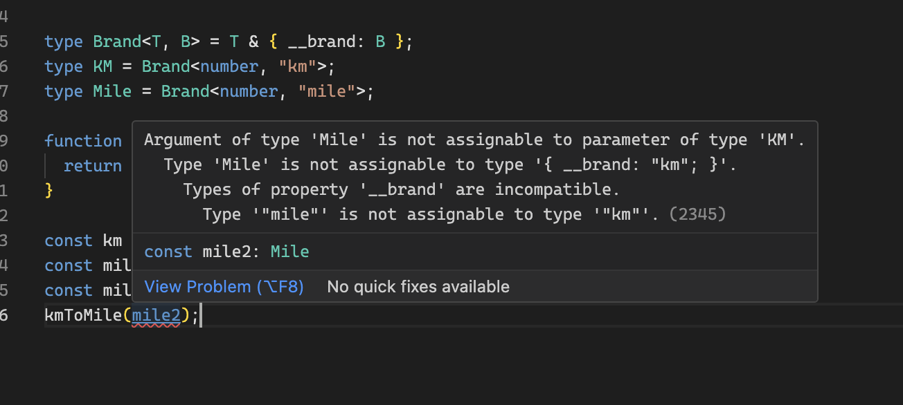

# 4주차 스터디 내용 정리

> #### info::출처
>
> 이 내용은 [타입스크립트 교과서](https://product.kyobobook.co.kr/detail/S000208416779) 책을 읽고 스터디한 내용을 바탕으로 정리했습니다.

<!-- TOC -->
- [4주차 스터디 내용 정리](#4주차-스터디-내용-정리)
  - [2.22 infer로 타입스크립트의 추론을 직접 활용하자](#222-infer로-타입스크립트의-추론을-직접-활용하자)
    - [Infer 기본 구조](#infer-기본-구조)
    - [Ex 1)](#ex-1)
    - [Ex 2)](#ex-2)
- [**`ReturnType<T>`**](#returntypet)
  - [2.23 타입을 좁혀 정확한 타입을 얻어내자](#223-타입을-좁혀-정확한-타입을-얻어내자)
  - [2.24 자기 자신을 타입으로 사용하는 재귀 타입이 있다.](#224-자기-자신을-타입으로-사용하는-재귀-타입이-있다)
  - [2.25 정교한 문자열 조작을 위해 템플릿 리터럴 타입을 사용하자](#225-정교한-문자열-조작을-위해-템플릿-리터럴-타입을-사용하자)
  - [2.26 추가적인 타입 검사에는 satisfies 연산자를 사용하자](#226-추가적인-타입-검사에는-satisfies-연산자를-사용하자)
  - [2.27 타입스크립트는 건망증이 심하다](#227-타입스크립트는-건망증이-심하다)
  - [2.28 원시 자료형에도 브랜딩 기법을 사용할 수 있다](#228-원시-자료형에도-브랜딩-기법을-사용할-수-있다)


<!-- TOC -->


<br />

## 2.22 infer로 타입스크립트의 추론을 직접 활용하자

`infer` 예약어는 타입스크립트의 타입 추론 기능을 극한까지 활용하는 기능

```typescript
type El<T> = T extends (infer E)[] ? E : never;
type Str = El<string[]>;
type NumOrBool = El<(number | boolean)[]>;
```

타입스크립트에서 추론을 맡기고 싶 부분을 ‘infer 타입_변수’로 표시하면 된다.

위의 코드는 E 타입은 참일 시 E, 거짓일 시 never 타입으로 추론(infer)된다.
이후, 참인 경우에 대응되는 식에서 추론한 E 타입을 사용할 수 있다.

예를 들어,

`Element<number> extends Element<infer U>`와 같은 타입을 작성하면, `U`타입은 `number`타입으로 추론(infer)된다. 이후, 참인 경우에 대응되는 식에서 추론한 `U`타입을 사용할 수 있다.

간단히 말하면 아래와 같이 정의할 수 있다.

참고: https://velog.io/@from_numpy/TypeScript-infer

> 조건부 타입의 조건식이 참인 경우 infer 예약어를 사용할 수 있다.
> 

```typescript
type El<T> = T extends (infer E)[] ? never : E; // error
```

컨디셔널 타입(? 연산)에서 타입 변수는 참 부분에서만 쓸 수 있다.
위의 경우 거짓일 때 E 타입을 사용한다는 코드인데 이럴 때는 에러가 발생한다.

<br />

### Infer 기본 구조

```typescript
T extends infer U ? X : Y
```

교재의 내용을 읽어도 이해하는 데 어려움이 있고 잘 읽히지 않아 위의 블로그 포스트를 읽고 
해당 내용을 이해하고 정리본을 작성합니다.

<br />

### Ex 1)

```typescript
type MyType<T> = T extends infer R ? R : null;

const a : MyType<number> = 123;
console.log(typeof a); //number
```

이 코드에서 타입_변수 R은 MyType<number>에서 받은 number 타입이 된다.

number 타입으로 추론이 가능하기 때문에 타입_변수 R을 반환하며, 추론이 불가능했다면 null을 반환했을 것이다.

```typescript
type MyType<T> = T extends number ? number : null;

const a : MyType<number> = 123;
console.log(typeof a); //number
```

이 두 코드는 똑같다. 그냥 이렇게 작성하면 되는데 굳이 infer를 붙일 필요가 있을까?
이런 간단한 예제에서는 infer 키워드가 필요하지 않다.

<br />

### Ex 2)

[TypeScript 한글 문서](https://typescript-kr.github.io/pages/utility-types.html#returntypet)

# **`ReturnType<T>`**

함수 `T`의 반환 타입으로 구성된 타입을 만듭니다.

ReturnType<T>는 TypeScript의 유틸리티 타입이다.

반환 타입으로 구성된 타입을 만드는 유틸리티 타입이다.

```typescript
declare function f1(): { a: number, b: string }
type T0 = ReturnType<() => string>;  // string
type T1 = ReturnType<(s: string) => void>;  // void
type T2 = ReturnType<(<T>() => T)>;  // {}
type T3 = ReturnType<(<T extends U, U extends number[]>() => T)>;  // number[]
type T4 = ReturnType<typeof f1>;  // { a: number, b: string }
type T5 = ReturnType<any>;  // any
type T6 = ReturnType<never>;  // any
type T7 = ReturnType<string>;  // 오류
type T8 = ReturnType<Function>;  // 오류
```

```typescript
type ReturnType<T extends (...args: any) => any> = T extends (...args: any) => infer R ? R : any;

function fn(num: number) {
  return num.toString(); 
}

const a : ReturnType<typeof fn> = "Hello";   // ReturnType<T> 이용 // ReturnType<T> --> Utility Types
console.log(a); //Hello
```

이 코드는 아래와 같이 작성할 수 있다.

```typescript
declare function f1(): {
	a: string;
	b: number;
}

type T0 = ReturnType<() => string> // string
type T1 = ReturnType<(s : string) => void>;  // void
type T2 = ReturnType<typeof f1>; // {a: string , b: number}
```

이런식으로 작성할 수 있는 코드이다.

유틸리티 타입을 사용하면 전역으로 타입이 작용한다.

ReturnType으로 위에서 반환 값으로 string, void를 뱉어서 string, void가 나왔고 

T2에서의 경우 반환으로 typeof f1을 했다. f1 함수는 a: string, b: number를 가지고 있기 때문에 저 타입이 반환된다.

지금 이 부분을

```typescript
function fn(num: number) {
  return num.toString(); 
}

const a : ReturnType<typeof fn> = "Hello"; // ReturnType<T> --> Utility Types
console.log(a); //Hello
```

이 부분으로 처리할 수 있다는 것이다.

```typescript
type ReturnType<T extends (...args: any) => any> = T extends (...args: any) => infer R ? R : any;
```

이 ReturnType은 infer 키워드를 통해서 생성되었다.

```typescript
type ReturnType<T extends (...args : any) => any> = string; // "string"으로 바로 명시

function fn(num : number) {
  return num.toString(); 
}

const a : ReturnType<typeof fn> = "Hello";
console.log(a); //Hello
```

만약 이렇게 infer를 사용하지않아도 string 타입을 반환하기 때문에 오류 없이 코드는 동작한다.

여기서 fn 함수가 return으로 toString으로 string이 아니라 다른 number, boolean 타입을 반환한다면 오류가 발생할 것이다.

그에 따라 유니온 타입을 적용해서 string | number 이런식으로 계속 직접적으로 변경해줘야할 것이다.

```typescript
type ReturnType<T extends (...args : any) => any> = string | number;  // 유니온 타입

function fn(num : number) {
  return num; 
}

const a : ReturnType<typeof fn> = 6;
console.log(a); // 6
```

이는 굉장히 불편하며 이렇게 작성하는 것에 대해 의구심을 품을 것이다.

ReturnType<T>의 취지에서도 벗어난다.

그래서 이럴 때 infer 키워드를 통해서 타입을 추론시킨다.

```typescript
type ReturnType<T extends (...args : any) => any> = T extends (...args : any) => infer R ? R : any;

function fn(num : number) {
  return num.toString(); 
}

const a : ReturnType<typeof fn> = "Hello";
```

<aside>
⚔️ 교재에서도 나온 오류가 발생함 ⇒ chatGPT 답변

</aside>

```
Duplicate identifier 'ReturnType'.(2300)
lib.es5.d.ts(1636, 6): 'ReturnType' was also declared here.
type ReturnType<T extends (...args: any) => any> = T extends (...args: any) => infer R ? R : any
No quick fixes availab
```

여기서는 **`ReturnType`**이 두 번 정의되어 있는 것으로 보이며, 그 중 하나는 TypeScript 내장 라이브러리(lib.es5.d.ts)에서 가져온 것으로 나타납니다. 아마도 코드의 다른 부분에서 **`ReturnType`**이라는 타입을 재정의하려고 시도한 것 같습니다.

이름 변경: **`ReturnType`**과 같은 이름의 타입을 다른 이름으로 변경하십시오. 예를 들어, **`MyReturnType`** 등으로 변경할 수 있습니다.

```typescript
type MyReturnType<T extends (...args: any) => any> = T extends (...args: any) => infer R ? R : any;
```

교재에서처럼 My를 붙이는 것이 하나의 방법이다.

이 외에는 tsconfig.json에서

```typescript
{
  "compilerOptions": {
    "lib": []
  }
}
```

라이브러리의 사용 중지: 필요한 경우, TypeScript 내장 라이브러리(lib.es5.d.ts)의 **`ReturnType`** 정의를 사용하지 않도록 설정하십시오. 이를 위해 **`tsconfig.json`** 파일을 수정하여 라이브러리의 사용을 중지하거나 제어할 수 있습니다. 다음은 라이브러리를 사용하지 않도록 설정하는 방법입니다.

→ My를 붙이는 것이 좋은 것 같다.

Record<T, K> 유틸리티 타입은 몇 번 봤는데 유틸리티 타입이 생각 이상으로 많아서 당황했다,,

```typescript
type MyReturnType<T extends (...args : any) => any> = T extends (...args : any) => infer R ? R : any;

function fn(num : number) {
  return num; 
}

const a : ReturnType<typeof fn> = 6;
console.log(a); // 6
```

위의 코드에서 이렇게 num같은 경우로 변경해도 유니온 타입을 지정해서 일일히 직접적으로 변경해줄 필요 없이 infer 키워드를 사용하면 모두 호환되는 것을 확인할 수 있다.

<br />

## 2.23 타입을 좁혀 정확한 타입을 얻어내자

타입 좁히기를 시도할 떄 무조건 typeof를 사용할 필요 없다.

타입스크립트는 자바스크립트 문법을 사용한다는 것을 잊지 말자.

```typescript
function strOrNullOrUndefined(param: string | null | undefined) {
	if (param === undefined) {
		param; // undefined
	} else if (param === null) {
		param; // null
	} else {
		param; // string
	}
}
```

- 배열을 구분하는 방법

```typescript
function strOrNumArr(param: string | number[]) {
  if (Array.isArray(param)) {
    param; // number[]
  } else {
    param; // string
  }
}
```

Array.isArray를 사용함

- 클래스를 구분하는 방법

```typescript
class A {}
class B {}
function classAorB (param: A | B) {
  if (param instanceof A) {
    param; // param: A
  } else {
    param; // param: B
  }
}
```

instanceof를 사용함

- 객체를 구분하는 방법 (중요)

```typescript
interface X {
  width: number;
  height: number;
}

interface Y {
  length: number;
  center: number;
}

function objXorY(param: X | Y) {
  if (param instanceof X) { // error
    param;
  } else {
    param;
  }
}
```

X에서 에러가 발생한다.

타입 좁히기는 위에서 말했듯이 자바스크립트 문법을 사용해서 진행하기 때문에 X는 interface이다.

자바스크립트에는 interface가 없다. X는 자바스크립트의 값이 아니라 타입스크립트의 인터페이스이므로 에러가 발생한다.

**→ 와 진짜 이건 좀 사고인데,, 여러모로 문제가 많다 이거,,**

> 타입 좁히기는 자바스크립트 문법을 사용해서 진행해야 한다.
자바스크립트에서도 실행할 수 있는 코드여야 하기 때문이다.
> 

알다시피 타입스크립트는 tsc를 사용해서 컴파일러를 통해 자바스크립트 코드로 변환 후 실행된다.
이러한 이유 때문에 일어난 문제같은데 진짜 여러모로 좀 문제가 많은 것 같다,,

그러면 어떻게 해야하는가?

```typescript
interface X {
  width: number;
  height: number;
}

interface Y {
  length: number;
  center: number;
}

function objXorY(param: X | Y) {
  if ("width" in param) {
    param; // param: X
  } else {
    param; // param: Y
  }
}
```

요소가 있는지 없는지로 구분해서 찾을 수 있다.

in 연산자의 경우 파이썬에서도 사용했다보니 낯이 익어서 사용하는데 큰 지장은 없을 것 같다.

다만 자바스크립트에서는 위에서처럼 안하고

param.width, “width” in param을 해도 둘다 가능하다.

타입스크립트에서는 param.width를 하면 오류가 발생한다.
왜 Why → Y에는 width 요소가 없기 때문

- 브랜드 속성 사용하기

```typescript
interface Money {
  __type: 'money';
  amount: number;
  unit: string;
}

interface Liter {
  __type: "liter";
  amount: number;
  unit: string;
}

function moneyOrLiter(param: Money | Liter) {
  if (param.__type === "money") {
    param; // param: Money
  } else {
    param; // param: Liter
  }
}
```

- 직접 타입 좁히기 함수를 만들기

```typescript
function isMoney(param: Money | Liter) {
  if (param.__type === "money") {
    return true;
  } else {
    return false;
  }
}

function moneyOrLiter(param: Money | Liter) {
  if (isMoney(param) {
    param; // param: Money | Liter
  } else {
    param; // param: Money | Liter
  }
}
```

타입 구분을 할 수가 없다.

if문에서 사용하는 함수를 직접 만들면 타입 좁히기가 정상 작동하지 않는다.

```typescript
function isMoney(param: Money | Liter): param is Money {
  if (param.__type === "money") {
    return true;
  } else {
    return false;
  }
}

function moneyOrLiter(param: Money | Liter) {
  if (isMoney(param) {
    param; // param: Money | Liter
  } else {
    param; // param: Money | Liter
  }
}
```

위의 param is Money를 타입 서술 함수 라고 부른다. (Type Predicate)
Predicate는 매개변수 하나를 받아 boolean을 반환하는 함수를 의미한다.

is를 사용했기 때문에 타입은 기본적으로 boolean이다. 이렇게 좁히기가 한번 시행된다.

is Money가 아니라 Liter로 하면 반대로 되어버리기 때문에 주의할 것
최대한 기본적인 타입 좁히기를 먼저 시도하고, 정 안 될 때 타입 서술을 사용하는 것이 좋다고 저자는 권장한다고 한다.

<br />

## 2.24 자기 자신을 타입으로 사용하는 재귀 타입이 있다.

재귀함수에 정말 취약한데 재귀 함수가 나왔다.
필자인 나는 재귀에 정말 취약하다,, 너무 어렵다,,,

유명한 재귀로는 피보나치 함수가 있다.

```typescript
function fibonacci(num) {
	if (num <= 1) return 1;
	return fibonacci(num - 1) + fibonacci(num - 2);
}
```

타입스크립트의 재귀 타입

```typescript
type Recursive = {
  name: string;
  children: Recursive[];
};

const recur1: Recursive = {
  name: "test",
  children: [],
};
```

<br />

## 2.25 정교한 문자열 조작을 위해 템플릿 리터럴 타입을 사용하자

템플릿 리터럴 타입은 특수한 문자열 타입이다.

백틱과 보간을 사용하는 자바스크립트의 템플릿 리터럴과 사용법이 비슷하지만, **값 대신 타입**을 만들기 위해 사용한다.

```typescript
type Template = `template ${string}`;
let str: Template = `template `;
str = `template hello`;
str = `template 123`;
str = 'template`; // 오류 위의 템플릿 리터럴 양식과 달리 띄어쓰기가 없어서 오류가 발생함
```

- P.159 교재에서 변수 음영과 오류 코드 위치가 `template 123` 으로 잘못되어있음
→ 이미 누군가가 issue 올림

띄어쓰기 하나가 있고 없고까지 구분하는 것으로 보아 템플릿 리터럴 타입을 사용하면 문자열 변수를 굉장히 엄격하게 관리할 수 있다.

```typescript
type City = 'seoul' | 'suwon' | 'yongin';
type Vehicle = 'car' | 'bike' | 'walk';
type ID = `${City}:${Vehicle}`;
const id: ID = 'seoul: walk'; // error
```

여기서도 교재에서 id: ID가 안붙었는데 타입 명시를 해주어야 오류를 확인할 수 있다.

여기서도 id는 seoul: 띄어쓰기 한칸을 추가했을 뿐인데 바로 오류가 발생하는 것을 확인할 수 있다.

**type을 템플릿 리터럴로 사용할 때는 이러한 점을 확실히 알고 사용해야한다.**

<br />

## 2.26 추가적인 타입 검사에는 satisfies 연산자를 사용하자

타입스크립트 4.9부터 추가된 연산자이다. 
타입 추론을 그대로 활용하면서 타입 검사를 추가로 하고 싶을 때 사용한다.

```typescript
const universe = {
  sum: "star", // error
  sriius: "star", // 위의 sum -> sun으로 수정하면 error
  earth: { type: "planet", parent: "sun" },
} satisfies {
  [key in 'sun' | 'sirius' | 'earth']: { type: string, parent: string } | string
}
```

statisfies를 붙인 코드이다.

타입 검사를 시행하기 때문에 오타를 찾을 수 있다.

교재에서 srrius에서만 오타를 내서 오타가 출력되는 것을 보았는데 위에서 sum으로 오타를 내보았더니
sum에서만 오류가 발생한다. 그리고 sum을 sun으로 바꾸면 이제 sriius가 오류가 발생하는 것을 볼 수 있다.

<br />

## 2.27 타입스크립트는 건망증이 심하다

타입스크립트는 타입을 주장할 때 그 타입이 일시적으로만 유지되고 바로 풀려버린다.

```typescript
try {} catch (error) {
  if (error) {
    error.message; // message에서 오류
  }
}

try {} catch (error) {
  if (error as Error) {
    error.message; // error에서 오류
  }
}
```

무슨 이런;

```typescript
try {} catch (error) {
  const err = error as Error;
  if (err) {
    err.message;
  }
}

try {} catch (error) {
  if (error instanceof Error) {
    error.message;
  }
}
```

가장 좋은 방법은 as를 사용하지않고 가장 아래의 코드처럼 작성하는 것이다.
하지만 이는 클래스의 인스턴스인 경우에만 가능하다.

어질 어질하다.

<br />

## 2.28 원시 자료형에도 브랜딩 기법을 사용할 수 있다

원시 자료형 타입에 브랜드 속성을 추가하는 기법
이 기법을 사용하면 string, number 같은 원시 자료형 타입도 더 세밀하게 구분할 수 있다.

```typescript
function kmToMile(km: number) {
  return km * 0.62;
}
const mile = kmToMile(3)
```

자바스크립트의 경우 3이라는 숫자가 있을 때 이 숫자가 킬로미터 단위인지 마일 단위인지 알 방법이 없다.
숫자라는 타입은 있지만 km인지 Mile인지 구분을 할 수 없기 때문

이때 브랜딩 기법을 사용해서 구체적으로 km인지 mile인지 정할 수 있음

```typescript
type Brand<T, B> = T & { __brand: B };
type KM = Brand<number, "km">;
type Mile = Brand<number, "mile">;

function kmToMile(km: KM) {
  return km * 0.62 as Mile;
}

const km = 3 as KM;
const mile = kmToMile(km);
const mile2 = 5 as Mile;
kmToMile(mile2); // error 
```

여기서도 교재 오류가 발생



가장 아랫줄에서 다음과 같은 오류가 발생

코드 설명:

Brand<T, B>
T는 원래 자료형, B는 새로 만들 자료형을 의미
& 연산자로 원래 자료형과 새로 만들 자료형을 합침 (and)

KM, Mile 타입은 존재하는 타입이 아닌데 만들어낸 타입이므로 as로 강제 지정해야한다.
한번 변환하고 나면 계속 그 변수를 KM, Mile 타입으로 사용할 수 있다.

위의 코드에서 mile2는 Mile 타입으로 변환했는데 kmToMile 함수는 KM 타입을 파라미터로 가지므로 알규먼트에 mile2넣을 수 없다.

이를 통해 KM 타입의 값만 넣을 수 있는 것을 표현할 수 있다.