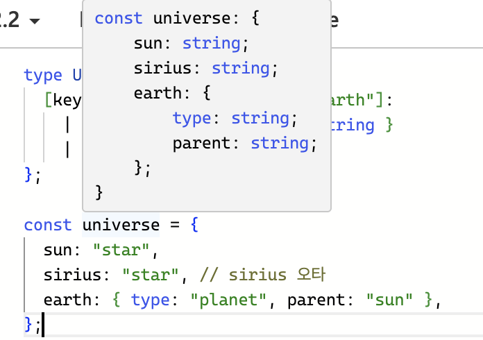
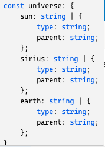

# Week4

진행자: 김수민  
page: p.144~p.166  
소단원: 2.22장~2.28장  
진행 일시: 2023년 10월 8일  

## 2.22 infer로 타입 추론하기

### infer를 사용해서 배열 요소의 타입 얻어내기

```typescript
//컨디셔널 타입에서 타입 변수는 참 부분에만 쓸 수 있습니다.
type El<T> = T extends (infer E)[] ? E : never;
type Str = El<string[]>;
type NumOrBool = El<(number | boolean)>;

const str: Str = 'hello';
console.log(typeof str);
```

typescript에서는 infer 키워드를 통해 타입을 추론할 수 있습니다. 위 코드에서 El 타입은 제네릭 인수 T가 배열 타입으로 확장 가능한 경우 추론된 타입 E로 타입을 지정하고, 그렇지 않은 경우 never로 추론하게 됩니다.
따라서 `console.log(typeof str);`를 출력해보면 string이 나옵니다.
반대로 NumOrBool의 타입은 never가 됩니다. 왜냐하면 제네릭 파라미터로 넘긴 `number | boolean`이라는 값이 배열 타입으로 추론되지 않아서 조건식에 의해 never가 되었기 때문입니다.

### infer를 사용해서 타입을 추론하는 여러가지 예시

### 매개변수의 타입 추론

```typescript
type MyParameters<T> = T extends (...args: infer P) => any ? P : never;
```

MyParameters는 제네릭 인수 T가 `(...args: infer P) => any`로 확장 가능한 경우에 매개변수에서 추론된 P 타입이 되고, 그렇지 않은 경우 never 타입이 되게 하는 타입입니다. 예제를 통해 이 타입의 동작을 알아보겠습니다.

```typescript
type MyFunction = (a: number, b: string) => void;
type MyFunctionParams = MyParameters<MyFunction>;
```

1. MyParameters의 제네릭 인수는 `(a: number, b: string) => void`입니다.
2. 이는 `(...args: infer P) => any`로 확장 가능한 형태이므로 MyParameters의 컨디셔널 타입 조건은 참이 되고 P가 반환됩니다.
3. 여기서 P는 MyFunction의 매개변수들이므로 MyFunctionParams는 `[number, string]`인 튜플 타입으로 추론됩니다.

### 생성자 매개변수의 타입 추론

```typescript
type MyConstructorParameters<T> = T extends abstract new (...args: infer P) => any ? P : never;
```

MyConstructorParameters는 제네릭 인수 T가 `new (...args: infer P)`로 확장 가능한 경우에 P 타입이 되고, 그렇지 않은 경우 never가 되게 하는 타입입니다. 예제를 통해 이 타입의 동작을 알아보겠습니다.

```typescript
abstract class MyAbstractClass {
    constructor(a: number, b: string) {}
}

type ConstructorParams = MyConstructorParameters<typeof MyAbstractClass>;
```

1. ConstructorParams의 제네릭 인수 T에 `typeof MyAbstractClass` 가 전달됩니다.
2. 이는 `new (...args: infer P)`로 확장 가능한 형태이므로 MyConstructorParameters의 컨디셔널 타입 조건은 참이 되고 P가 반환됩니다.
3. 여기서 P는 MyAbstractClass 생성자 매개변수들이므로 ConstructorParams은 `[number, string]`인 튜플 타입으로 추론됩니다.

### 함수 반환값의 타입 추론

```typescript
type MyReturnType<T> = T extends (...args: any) => infer R ? R : any;
```

MyReturnType은 제네릭 인수 T가 `(...args: any) => infer R`로 확장 가능한 경우에 R 타입이 되고, 그렇지 않은 경우 any가 되게 하는 타입입니다. 예제를 통해 이 타입의 동작을 알아보겠습니다.

```typescript
function add(a: number, b: string): string {
    return a + b;
}
type MyFunctionReturyType = MyReturnType<typeof add>;
```

1. MyFunctionReturyType의 제네릭 인수 T에 `(a: number, b: string) => string` 가 전달됩니다.
2. 이는 `(...args: any) => infer R`로 확장 가능한 형태이므로 MyReturnType의 컨디셔널 타입 조건은 참이되고 R이 반환됩니다.
3. 여기서 R은 MyFunction의 반환 값이므로 MyFunctionReturyType은 string이 됩니다.

### 인스턴스 타입 추론

```typescript
type MyInstanceType<T> = T extends abstract new (...args: any) => infer R ? R : any;
```

MyInstanceType은 제네릭 인수 T가 `abstract new (...args: any) => infer R`로 확장 가능한 경우에 R타입이 되고, 그렇지 않은 경우 any가 되게 하는 타입입니다. 예제를 통해 이 타입의 동작을 알아보겠습니다.

```typescript
abstract class MyAbstractClass {
    constructor(a: number, b: string) {}
}

type InstanceTypeOfAbstractClass = MyInstanceType<typeof MyAbstractClass>;
```

1. MyInstanceType의 제네릭 인수 T에 `typeof MyAbstractClass`가 전달됩니다.
2. 이는 `abstract new (...args: any) => infer R`로 확장 가능한 형태이므로 MyInstanceType 컨디셔널 타입 조건은 참이되고 R이 반환됩니다.
3. 여기서 R은 MyAbstractClass 그 자체이므로 InstanceTypeOfAbstractClass는 MyAbstractClass가 됩니다.

### infer 타입 변수 동시에 여러개 사용하기

```typescript
type MyPAndR<T> = T extends (...args: infer P ) => infer R ? [P, R] : never;
```

서로 다른 타입 변수를 여러 개 동시에 사용할 수도 있습니다.

> #### info::퀴즈
>
> ```typescript
> type MyPAndR\<T> = T extends (...args: infer P ) => infer R ? [P, R] : never;
> type MyFunction = (a: number, b: string) => void; 
> type Res = MyPAndR\<MyFunction>
>  ```
>  위와 같은 코드가 있을 때 Res의 타입으로 올바른 것을 고르세요.
>
>  1. type Res = [a: number, b: string]
>  2. type Res = [[a: number, b: string], void]
>  3. type Res = [a: number, b: string, void]

### 같은 타입 변수를 여러 곳에 사용하기

```typescript
type Union<T> = T extends { a: infer U, b: infer U } ? U : never;
type Result1 = Union<{ a: 1 | 2, b: 2 | 3}>;
//type Result1 = 1 | 2 | 3

type Intersection<T> = T extends {
	a: (pa: infer U) => void;
	b: (pb: infer U) => void
} ? U : never;
type Result2 = Intersection<{ a(pa: 1 | 2): void, b(pb: 2 | 3): void}>;
//type Result2 = 2
```

- 같은 타입 변수를 사용할 경우 Result1처럼 추론된 타입의 유니언 타입이 됩니다.
- 같은 타입 변수끼리는 서로 유니언이 되는 것이 기본이지만, Result2처럼 매개변수인 경우 인터섹션으로 동작합니다. 왜냐하면 매개변수는 반공병성을 갖고 있기 때문입니다.


## 2.23 타입 좁히기

### 유니언 타입을 좁히는 방법

```typescript
function strOfNum(param: string | null | undefined | number[]){
	if (typeof param === undefined){
		param;    // undefined
	} else if (param === null){
		param;    // null
	} else if (Array.isArray(param)){
		param;    // number[]
	} else{
		param;    // string
	}
}
```

- if문을 사용해서 타입을 좁힐 수 있습니다.
- 타입을 좁힐 때 항상 typeof를 사용해야 하는것은 아닙니다. 왜냐하면 typeof null은 object이기 때문입니다.
- 명시적인 유니언 타입만 타입 좁히기를 할 수 있는 것은 아닙니다. boolean 타입같은 경우 `true | false`라서 if문으로 타입을 좁힐 수 있습니다.
- 배열의 타입을 좁힐 때는 `Array.isArray` 메서드를 사용할 수 있습니다.

### 클래스에서 타입을 좁히는 방법

```typescript
class A {}
class B {}
function classAorB (param: A | B){
	if (param instanceof A){
		param;    // A
	} else {
	    param;    // B
	}
}
```

- 클래스에서는 `instanceof`를 사용해서 타입을 좁힐 수 있습니다.

### 인터페이스에서 타입을 좁히는 방법

```typescript
interface X {
	width: number;
	height: number;
}
interface Y {
	length: number;
	center: number;
}
function objXorY(param: X | Y){
	// if (param instanceof X){  => 1. 이렇게 하면 안됨
	// if (param.width){  => 2. 이렇게 하면 안됨
	if ('width' in param){
		param;
	}else{
		param;
	}
}
```

인터페이스에서 타입을 좁힐 때는 1번, 2번 주석 부분의 방법을 사용하면 안되고 in 연산자를 사용해야 합니다.
왜냐하면 **타입 좁히기는 자바스크립트 문법을 사용해서 진행해야 하기 때문** 입니다.
1번 주석 부분은 타입스크립트 문법인 인터페이스를 직접 사용하기 때문에 오류가 발생합니다.
2번 주석 부분은 X, Y 인터페이스 모두에 width 속성이 존재하는 것이 아니므로 오류가 발생합니다.
2.13절에서 봤던 타입의 브랜드 속성을 사용하면 보다 쉽게 객체를 구분할 수도 있습니다.

> #### info::왜 타입 좁히기는 자바스크립트 문법만들 사용해서 진행해야 할까요?
>
> **내 생각**: 타입스크립트는 실행될 때  자바스크립트로 변환되어 실행됩니다. 함수 안에서 if문을 사용해 타입을 좁히는 것은 런타임시에 일어나기 때문에 자바스크립트 코드만 사용해야 하는 것입니다. 특히, 인터페이스 같은 경우 자바스크립트로 변환될 때 사라지므로 `param instanceof X`는 동작할 수 없는 코드입니다.
> **(다른 분들의 생각도 궁금합니다!)**


### 타입 좁히기 함수 작성

```typescript
function isMoney(param: Money | Liter): param is Money{
	if(param.__type === 'money'){
		return true;
	} else {
		return false;
	}
}
function moneyOrLiter(param: Money | Liter){
	if(isMoney(param)){
		param;
	} else{
		param;
	}
}
```

타입을 좁히는 함수를 따로 작성해서 타입을 좁힐 수도 있습니다. 단, 이 경우 isMoney의 반환값 부분에 `param is Money`라고 작성한 것 처럼 타입 서술 함수(Type Predicate)를 작성해야합니다. 그렇지 않으면 타입스크립트가 좁혀진 타입을 구분할 수 없습니다.

### J088

```typescript
// 왜 안될까???
class A{}
class B{}

const isA = (arg:A|B): arg is A=>{
    if(arg instanceof A){
        return true;    
    } else if (arg instanceof B) {
	
}
    else{
        return false;
    }
}

const func = (arg:A|B)=>{
    if(isA(arg)){
        console.log(arg);
// A|B로 추론이된다.
    }    
}
```

## 2.24 재귀 타입

### 재귀 타입 사용하기

```typescript
type ElementType<T> = T extends any[] ? ElementType<T[number]> : T;  //1번
type T = number | string | Record<string, T>; //2번
type T = number | string | {[key: string]: T}; //3번
```

- 1번: 함수의 재귀 호출처럼 타입스크립트에서도 타입을 재귀적으로 선언할 수 있습니다.
- 2번: 단, 재귀 타입을 타입 인수로 사용할 수는 없습니다.
- 3번: 타입 인수를 사용해야 한다면 3번의 방법을 사용할 수 있습니다.
- J122
    
    ElementType이 어떻게 사용되는 것일까??
    
    from ChatGPT
    
    ```typescript
    type ElementType<T> = T extends any[] ? ElementType<T[number]> : T;
    
    type P = ElementType<number[][]> // number
    ```
    
    여기서 **`[number]`**는 인덱스 접근 타입입니다. 만약 **`T`**가 배열이라면 **`T[number]`**는 배열의 모든 요소 타입을 나타냅니다. 예를 들어, 만약 **`T`**가 **`number[]`**라면 **`T[number]`**는 **`number`**가 됩니다. 그리고 **`ElementType<T[number]>`** 부분은 다시 그 배열의 요소 타입을 찾아내는 재귀적인 조건부 타입입니다.
    
    이것을 더 자세히 설명하자면:
    
    - **`T[number]`**는 배열 **`T`**의 모든 요소를 나타냅니다.
    - **`ElementType<T[number]>`**는 **`T[number]`**의 요소 타입을 나타냅니다.
    - 따라서, **`T`**가 배열일 때 **`ElementType<T>`**는 배열의 요소 타입을 찾아냅니다.
    
    이를 통해 중첩된 배열에서도 올바른 요소 타입을 추출할 수 있습니다. 예를 들어, **`number[][]`**와 같은 중첩된 배열에 대해서도 제대로 작동하여 **`number`**를 찾아낼 수 있습니다.
    

### 재귀 타입의 무한 순회

```typescript
type InfiniteRecur<T> = { item: InfiniteRecur<T> };
type Unwrap<T> = T extends { item: infer U } ? Unwrap<U> : T;
type Result = Unwrap<InfiniteRecur<any>>;
```

재귀함수의 종료조건을 작성하지 않으면 `Maximum call stack size exceeded` 에러가 발생합니다.
이와 동일하게 타입스크립트의 재귀 타입도 종료조건이 없다면 에러가 발생합니다.
위 코드를 보면 InfiniteRecur 타입은 무한하게 중첩된 item 속성을 갖고 있습니다.(`{ item: {item: {item: ... }}`) 따라서 `Type instantiation is excess ivelydeepand possiblyinfinite.`이라는 에러가 표시됩니다.

### JSON을 재귀 타입으로 표현하기

```typescript
type JSONType =
	| string
	| boolean
	| number
	| null
	| JSONType[]
	| { [key: string]: JSONType };

const a: JSONType = 'string';
const b: JSONType = [1, false, { 'hi': 'json' }];
cosnt c: JSONType = {
	prop: null,
	arr: [{}],
}
```

재귀 타입을 사용하면 JSON의 구조도 쉽게 표현할 수 있습니다.

- 1. 재귀 타입으로 배열 타입 거꾸로 뒤집는 타입 만들어 보기 - J122 추가
    
    ```typescript
    type Origin = [number, string, boolean]
    type Reverse<T> = T extends [...infer L, infer R] ? [R, ...Reverse<L>] : [];
    ```
    
- 2. 1 타입을 응용해서 함수의 매개변수 순서를 바꾸는 타입 만들어 보기 - J122 추가
    
    ```typescript
    type Reverse<T> = T extends [...infer L, infer R] ? [R, ...Reverse<L>] : [];
    
    type FilpArgument<T> = T extends (...args: infer A) => infer R
      ? (...args: Reverse<A>) => R
      : never;
    
    type P = FilpArgument<(a: string, b: number) => string>;
    ```
    

type P = (args_0: number, args_1: string) => string

## 2.25 템플릿 리터럴 타입

### 템플릿 리터럴 타입 기본 사용법

```typescript
type City = 'seoul' | 'suwon' | 'busan';
type Vehicle = 'car' | 'bike' | 'walk';
type ID = `${City}:${Vehicle}`;
const id: ID = 'seoul:walk'; // 교재에서 :ID 타입 지정을 하지 않음 (오류)
```

위와 같이 템플릿 리터럴 타입을 사용해서 타입을 정의할 수도 있습니다.
ID 타입은 City와 Vehicle를 조합한 템플릿 리터럴 문자열로 이루어져 있습니다. ID 타입은 각각 타입의 경우의 수를 자동으로 조합해서 총 9가지의 타입이 됩니다.

### 템플릿 리터럴 타입과 infer를 함께 사용하기

```typescript
type RemoveX<Str> = Str extends `x${infer Rest}`
	? RemoveX<Rest>
	: Str extends `${infer Rest}x` ? RemoveX<Rest> : Str;
type Removed = RemoveX<'xxtestxx'>;
```

템플릿 리터럴 타입과 infer를 함께 사용해서 타입의 좌우 공백을 지우는 타입을 만들 수도 있습니다.
위 코드의 작동 방식은 다음과 같습니다.

1. RemoveX의 제네릭 인수로 'xxtestxx'가 넘겨집니다.
2. 이는 `x${infer Rest}`으로 확장 가능하기 때문에 'xxtestxx'에서 맨 왼쪽에 있는 x를 제외한 'xtestxx'가 다시 제네릭 인수로 전달됩니다.
3. 1번, 2번 과정을 한번 더 거치면 'testxx'가 되어 왼쪽에 있는 x가 모두 제거됩니다.
4. 동일한 방식으로 오른쪽의 x도 제거됩니다.

## 2.26 satisfies 연산자

```typescript
const universe: {
	[key in 'sun' | 'sirius' | 'earth']: { type: string, parent: string } | string
} = {
	sum: "star",
	sirius: "star",
	earth: { type: "planet", parent: "sun" },
};
```

universe의 변수 타입을 위와 같이 정의했을 때, `universe.earth.type` 으로 접근해서 속성 값을 사용한다면 타입스크립트는 earth가 객체라는 것을 제대로 잡아내지 못합니다. 왜냐하면 `{ type: string, parent: string } | string`을 유니언으로 연결했기 때문에 earth가 string일수도 있는 확률이 있기 때문입니다.
이 경우 아래와 같이 `satisfies` 연산자를 사용해서 해결할 수 있습니다.

```typescript
const universe = {
	sun: "star",
	sirius: "star",
	earth: { type: "planet", parent: "sun" },
} satisfies {
	[key in 'sun' | 'sirius' | 'earth']: {type: string, parent: string} | string
};
```

satisfies 연산자를 사용하면 `universe` 변수에서 타입이 추론된 것을 그대로 사용하면서, 각각의 속성들은 satisfies 뒤에 적은 타입으로 다시 한번 검사합니다.

### J088 예시 하나 추가

```typescript
type MyState = StateName | StateCordinates

type StateName = 'Seoul' | 'Busan' | 'Daegu'

type StateCordinates = { x: number, y: number }

type User = {
  birthState: MyState,
  currentState: MyState,
}

const user = {
  birthState: 'Seoul',
  currentState: { x: 3, y: 4 },
} satisfies User;

user.birthState.toUpperCase()
```

- J122 의견





## 2.27 타입 주장은 변수에 적용해야만 유지된다.

```typescript
try {} catch (error) {
	if (error as Error){
		error.message;   // 'error' is of type 'unknown'
	}
}
```

try-catch문에서 error는 unknown 타입입니다. 그래서 이를 사용하기 위해서는 error의 타입이 Error이라고 주장해야 합니다. 하지만 위와 같이 사용하게 되면 `'error' is of type 'unknown'` 에러가 발생합니다.
왜냐하면 as로 타입을 주장한 것은 if문이 참인지 거짓인지를 판단할 때만 Error 타입이 되고, 판단한 후에는 원래 타입으로 되돌아가기 때문입니다. 따라서 이 문제를 해결하려면 주장한 타입을 계속 기억할 수 있게 변수에 저장해야 합니다.

```typescript
//방법1: 변수에 저장하기
try {} catch (error) {
	const err = error as Error;
	if (err){
		error.message;
	}
}
//방법2: as를 사용하지 않는 방법
try {} catch (error) {
	if (error instanceof Error){
		error.message;
	}
}
```

## 2.28 원시 자료형에 브랜딩 기법 사용하기

```typescript
type Brand<T, B> = T & { __brand: B };
type KM = Brand<number, 'km'>;
type Mile = Brand<number, 'mile'>;

function kmToMile(km: number){
	return km * 0.62;
}

const km = 3 as KM;
const mile = kmToMile(km);
const mile2 = 5 as Mile;
kmToMile(mile2); // error (여기서도 이 부분이 오류인데 교재 오류)
```

- `Brand<T, B>` 타입은 원시 자료형(T)와 브랜딩 키워드(B)를 인터섹션 연산을 통해 합쳐서 원시 자료형에 브랜딩을 추가할 수 있습니다.
- 브랜딩을 추가해서 만든 원시 자료형 KM, Mile은 원래 존재하는 타입이 아니므로 as를 사용해 강제로 형변환 해야합니다. 하지만 한번 변환하고 나면 그 다음부터는 계속 브랜딩이 추가된 타입으로 사용할 수 있습니다.

## J088 예시하나 더 추가 with gpt

```typescript
type UserID = string & { readonly brand: unique symbol };
type OrderID = string & { readonly brand: unique symbol };

function createUserID(id: string): UserID {
    return id as UserID;
}

function createOrderID(id: string): OrderID {
    return id as OrderID;
}

function queryUser(id: UserID) {
    // 데이터베이스 또는 API 쿼리 코드
}

function queryOrder(id: OrderID) {
    // 데이터베이스 또는 API 쿼리 코드
}

const myUserID = createUserID("user1234");
	// 타입이 UserId타입으로 지정이 된다.
const myOrderID = createOrderID("order5678");
// 타입이 OrderId타입으로 지정이 된다.
// 이러면 해당 변수만 보고서 원시 타입이 아닌 어떤 값을 받는것인지 더 명확해 진다.

queryUser(myUserID);
queryOrder(myOrderID);

// 다음 코드는 컴파일 에러를 발생시킵니다. 
// 각 함수는 브랜딩된 ID만 받아들입니다.
// queryUser(myOrderID);
// queryOrder(myUserID);
```