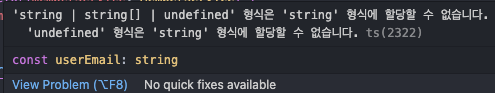
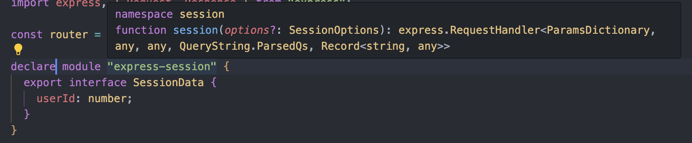
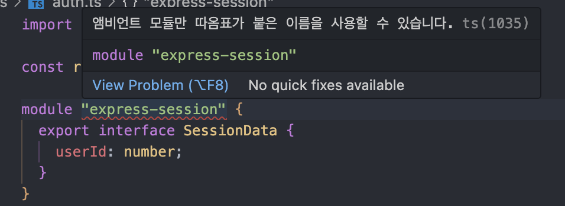
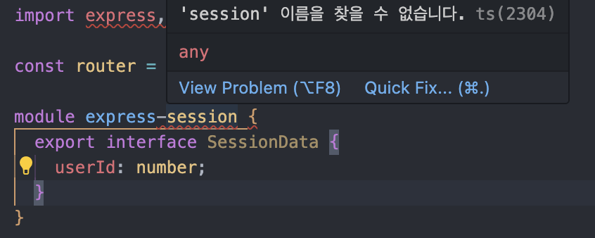

# 5주차 스터디 내용 정리

> #### info::출처
>
> 이 내용은 [타입스크립트 교과서](https://product.kyobobook.co.kr/detail/S000208416779) 책을 읽고 스터디한 내용을 바탕으로 정리했습니다.

<!-- TOC -->
- [5주차 스터디 내용 정리](#5주차-스터디-내용-정리)
  - [2.29 배운 것을 바탕으로 타입을 만들어보자](#229-배운-것을-바탕으로-타입을-만들어보자)
    - [2.29.1 판단하는 타입 만들기](#2291-판단하는-타입-만들기)
    - [2.29.2 집합 관련 타입 만들기](#2292-집합-관련-타입-만들기)
  - [2.30 타입스크립트의 에러코드로 검색하자](#230-타입스크립트의-에러코드로-검색하자)
  - [2.31 함수에 기능을 추가하는 데코레이터 함수가 있다.](#231-함수에-기능을-추가하는-데코레이터-함수가-있다)
  - [2.32 앰비언트 선언도 선언 병합이 된다](#232-앰비언트-선언도-선언-병합이-된다)

<!-- TOC -->


<br />

## 2.29 배운 것을 바탕으로 타입을 만들어보자

### 2.29.1 판단하는 타입 만들기

타입스크립트를 작성할 때는 특정 타입이 무슨 타입인지 판단할 수 있어야 한다.타입을 컨디셔널 타입으로 제거할 수도, 그 타입만 추릴 수도 있다.

먼저 정리를 해보겠다.

타입이란 **가능한 값**의 집합이다.

`never` 타입은 어떠한 값도 할당할 수 없는 타입이다.
어떠한 값도 할당할 수 없기 때문에 **공집합**이라고 말할 수 있다.

아래 코드에서 extends 예약어는 상속이 아니라 제약 조건을 걸기 위한 예약어라는 것을 인지하자.

그리고 type, interface는 첫 문자를 대문자로 작성하는 것을 잊지말자.

> IsNever
> 

먼저 never인지 판단하는 타입을 만들어보자.

```typescript
type IsNever<T> = [T] extends [never] ? true : false;
```

배열로 감싸는 이유: T에 never를 넣을 때 분배법칙이 일어나는 것을 막기 위함

> IsAny
> 

```typescript
type IsAny<T> = string extends (number & T) ? true : false;
```

string과 number는 겹치지 않아서 extends할 수 없다.
또한 number & T는 number의 부분집합이므로 더욱 string과 겹치지 않는다.

하지만 T가 any라면?
number & any = any이고, string은 any를 extends할 수 있다.
따라서 T가 any일 때만 true이므로 any인지 아닌지 판단할 수 있다.

→ string을 가지고 제약조건과 비교를 하는데 number & T와 string은 절대 겹치지가 않아서 false를 반환할 것이다. 하지만 T가 any라면? string에 extends 제약조건이 성립하기 때문에 true를 반환한다.
고로 any일 경우 true를 반환하는 타입을 이렇게 지정할 수 있다.

> IsArray
> 

```typescript
type IsArray<T> = T extends unknown[] ? true : false;
```

이렇게만 작성하면 반례를 생각하지 않은 것이다.
T가 never, any, readonly [] 타입일 때는 false가 되지 않기 때문에 반례가 충분히 일어날 수 있다.

```typescript
type IsArray<T> = IsNever<T> extends true
 ? false
 : T extends readonly unknown[]
	 ? IsAny<T> extends true
		 ? false
		 : true
	: false;
```

이렇게 작성해야하는데 많이 복잡하다.

1. IsArray<never>가 never가 되는 것을 막기 위해 IsNever<T> extends true가 필요
2. IsArray<any>가 boolean이 되는 것을 막기 위해 IsAny<T> extends true가 필요
3. IsArray<readonly []>가 false가 되는 것을 막기 위해 T extends readonly unknown[]이 필요

위에서 말한 저 3가지 반례를 커버하는 코드를 작성해야하기 때문에 많이 복잡하고 까다롭다.

> IsTuple
> 

```typescript
type IsTuple<T> = = IsNever<T> extends true
 ? false
 : T extends readonly unknown[]
	 ? number extends T["length"]
		 ? false
		 : true
	 : false;
```

배열과 튜플의 차이점은 튜플은 길이가 고정되어있다.
튜플이 아닌 배열은 length가 number이다. 튜플은 1, 2, 3 같은 개별 숫자이기 때문에 number extends T[”length”]가 false여야 하는 것이 중요하다.

> IsUnion
> 

```typescript
type IsUnion<T, U = T> = IsNever<T> extends true
 ? false
 : T extends T
	 ? [U] extends [T]
		 ? false
		 : true
	 : false;
```

1. U = T로 타입 매개변수를 왜 하나 더 만들었을까?
2. T extends T는 무슨 의미일까?
T extends T는 항상 true이다. 그런데 사용하는 이유는 분배법칙을 만들기 위해서 사용한다.
유니언의 경우 컨디셔널 타입 제네릭과 만나면 분배법칙이 발생한다.

T가 string | number인 경우 T extends T는 string | number extends string | number가 아니라
분배법칙이 일어난다.
→ (string extensd string | number) | (number extends string | number)

그리고 이 다음 코드인 [U] extends [T]는 [string | number] extends [string] 또는 [string | number] extends [number]가 된다. U = T 매개변수를 하나 더 만들어서 분배법칙이 일어나지않은 원본 타입을 담아두었다.

최종적으로 [U] extends [T]는 false가 되어 최종적으로 IsUnion<string | number>는 true가 된다.

만약 T가 string이었다면 [U] extends [T]에서 [string] extends [string]이 되므로 true가 되어버리는데 이러면 최종적으로 IsUnion<string>은 false가 된다.

? false : true : false를 이용해서 나온 것에서 한번 더 꺾는다. 

<br />

### 2.29.2 집합 관련 타입 만들기

위에서 정리해놓았듯이 타입스크립트의 타입은 집합으로 생각해도 될 정도로 집합의 원리를 충실하게 따르고 있고 구글링을 해보아도 아예 집합이라고 생각하는 사람들이 많다.

전체 집합: unknown, 공집합: never, 합집합, 교집합도 or, and 연산자(|, &)가 있다.

차집합은 무엇일까?
수학적인 집합 설명은 생략한다. 수1을 공부하도록,,

말 그래도 차(-) 집합이다.

A가 {name : string, age: number}, B가 {name: string, married: boolean}일 시 
이 둘의 차집합은 (A-B) = {age: number}, (B-A) = {married: boolean}이 나온다.

```typescript
type Diff<A, B> = Omit<A & B, keyof B>;
type R1 = Diff<{ name: string, age: number }, { name: string, married: boolean }>;
// type R1 = { age: number }
```

1. Omit
Omit 타입은 특정 객체에서 지정한 속성을 제거하는 타입이다.
A & B는 합집합으로 { name: string, age: number, married: boolean }을 만든다.
여기서 keyof B는 name | married이다. 그러니 위의 합집합에서 이 두개를 빼면 age만 남는다.
2. Diff
대칭차집합을 찾아낼 수도있다.

```typescript
type SymDiff<A, B> = Omit<A & B, keyof (A | B)>;
type R2 = SymDiff<{ name: string, age: number }, { name: string, married: boolean }>;
// type R2 = { age: number, married: boolean }
```

A & B는 합집합으로 { name: string, age: number, married: boolean }을 만든다.
keyof (A | B)를 통해 제거되는 값은 name : string이다.
이런식으로 대칭차집합을 만들 수 있다.

다만 이 코드에서 차집합과 대칭차집합은 객체({})에만 적용이 가능하다.
유니언에도 적용하려면 이렇게 작성해야한다.

```typescript
type SymDiffUnion<A, B> = Exclude<A | B, A & B>;
type R3 = SymDiffUnion< 1 | 2 | 3, 2 | 3 | 4>;
// type R3 = 1 | 4
```

1. Exclude
어떤 타입(A | B)에서 다른 타입(A & B)을 제거한는 타입이다.
고로 위에서 1 | 2 | 3 | 2 | 3 | 4 = 1 | 2 | 3 | 4인데 여기서 A & B는 2 | 3이다.
1 | 4만 남는다.

```typescript
type IsSubset<A, B> = A extends B ? true : false;
type R1 = IsSubset<string, string | number>; // true
type R2 = IsSubset<{ name: string, age: number }, { name: string }>; // true
type R3 = IsSubset<symbol, unknown>; // true
```

간단한 코드이다. A extends B를 통해서 A와 B가 같은 같으면 true 아니면 false를 반환한다.

A가 B타입에 대입이 가능하다. === A는 B의 부분집합이다.

1. Equal
두 타입이 동일하는 것을 판단하려면 A와 B가 있을 때 서로가 부분집합이면 집합 A, B가 서로 동일하다는 것을 뜻한다.

```typescript
type Equal<A, B> = A extends B ? B extends A ? true : false : false;
```

여기에서도 하지만 반례가 발생한다.

<aside>
✨ 위에서 말했듯이 boolean, never은 유니언이므로 분배법칙이 발생한다.

</aside>

분배법칙이 일어나지 않는 코드

```typescript
type Equal<A, B> = [A] extends [B] ? [B] extends [A] ? true : false : false;
```

또 이러면 any와 다른 타입을 구분하지 못한다고 한다.

```typescript
type Equal2<X, Y> = (<T>() => T extends X ? 1 : 2) extends (<T>() => T extends Y ? 1 : 2) ? true : false;
```

한번 읽고 넘어가겠다.. (P. 173)

1. NotEqual

```typescript
type NotEqual<X, Y> = Equal<X, Y> extends true ? false : true;
```

<br />

## 2.30 타입스크립트의 에러코드로 검색하자

이건 엄청나게 유용한 기능인 것 같다.

물론 에러가 나서 모르겠을 때 chatGPT를 이용해서 빠르게 처리하고 있는데 

가장 끝에 나오는 오류들



막상 검색을 해보았더니 공식문서라기보다는 수많은 포스트들을 확인할 수 있었다.

여기서 저 ‘string | string[]……’ 을 복사해서 구글에 붙여넣었으면 해결 못했겠지만 이런식의 검색 방법은 굉장히 유용한 것 같다.

## 2.31 함수에 기능을 추가하는 데코레이터 함수가 있다.

타입스크립트 5.0에서 데코레이터 함수가 정식으로 추가되었다.

```typescript
function startAndEnd(originalMethod: any, context: any) {
    function replacementMethod(this: any, ...args: any[]) {
        console.log("start");
        const result = originalMethod.call(this, ...args);
        console.log("end");
        return result;
    }
    return replacementMethod
}

class A {
    @startAndEnd
    eat() {
        console.log("Eat");
    }

    @startAndEnd
    work() {
        console.log("Work");
    }

    @startAndEnd
    sleap() {
        console.log("Sleep");
    }
}
```

이 코드는 본래 데코레이터를 사용하지 않은 상태에서는 eat, work, sleap에 메서드에 중복적으로 start, end 콘솔로그가 각각의 메서드에 모두 포함되어있었다.

이렇게 중복이 있는 경우 중복을 해결하기 위해 데코레이터를 사용해서 제거할 수 있다.
내가 생각한 것 보다 복잡한데,,

백엔드 학습을 하다보면 데코레이터를 주로 사용하기 때문에 유심히 보았는데
내가 작성할 코드와는 살짝 다른 감이 있다. @Get, @Post 이런식으로 하던지 @Controller 
이렇게 사용하는 것과는 많이 다른 것 같다.

이 부분에 대해서는 코드 자체도 워낙 복잡하고 직접 데코레이터를 생성해서 만들 일은 잘 없을 것 같다.

P.175부터 개인적으로 읽으며 이해해보도록 하자,, 
나는 한번 스윽 읽고 넘기기로 결정하였다. (봐도 머리에 지금은 잘 들어오지가 않는다.)

언젠가 직접 데코레이터를 작성할 순간이 온다면 그때 서치해서 사용해보도록 하겠다.

<br />

## 2.32 앰비언트 선언도 선언 병합이 된다

타입스크립트에서 남의 라이브러리를 사용할 때 그 라이브러리가 자바스크립트라면 직접 타이핑 해야 하는 경우가 생긴다.
그럴 때 사용 하는 것이 앰비언트 선언이다.

앰비언트 선언을 위해서는 declare 예약어를 사용해야 한다.

이게 무엇인가 했는데 나도 한번 사용해보았다.

web 첫번째 프로젝트를 할 떄 express-session을 처리하는 과정에서 JS로 코드가 작성되어있어서 그대로 사용하면 오류가 발생하였다.

```typescript
declare module "express-session" {
  export interface SessionData {
    userId: number;
  }
}

...

if (user) {
    req.session.userId = user.id; // 세션에 사용자 ID 저장
    const userId = req.session.userId;

    console.error("로그인 성공");
    res.send(`로그인 성공\nUserId: ${userId}`);
  } else {
    console.error("로그인 실패");
    res.status(401).send("로그인 실패");
  }
});
```

그때 이렇게 해당 express-session 모듈에 declare를 사용해서 타입을 지정한 적이 있다.

그리고 저렇게 해당 session에서 userId라는 변수에 사용자 id를 저장할 수 있었다.

enum, namespace를 교재에서는 설명을 기본적으로 했고 인터페이스와 타입 별칭에 대해서도 소개하였다.

교재를 읽으면서 알게된 점은 인터페이스와 타입 별칭은 declare로 선언하지 않아도 동일하게 작동하므로 굳이 declare를 붙일 필요가 없다는 것이다.





declare를 제거하면 이렇게 나온다.

그리고 검색하면 나온다고 해놓고 TS1035 검색하면 안나온다,,



그냥 하라는대로 따옴표를 빼면 이렇게 나온다. 어떻게 처리하는 것일까?

위에서 express-session을 올린 결과 namespace로 선언되는 것으로 보아 저 코드는 declare를 사용하는 것이 맞다고 판단하였다.