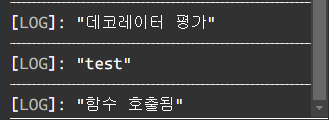
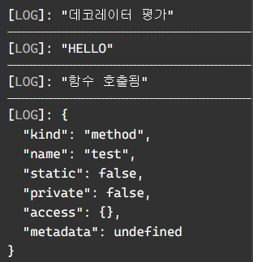

## 2.29 배운것을 바탕으로 타입을 만들어보자

```tsx
type isNever<T> = [T] extends [never] ? true : false;
```

never는 공집합이라 분배법칙이 일어나야 하는데 공집합이라 분배법칙이 일어나지 않아 []가 없으면 never가 됩니다.

```tsx
type isAny<T> = string extends number & T ? true : false;
type isAny2<T> = symbol extends string &T ? true :false;
```

any는 unknown boolean number string never를 제외해야 합니다. 따라서 꼼수를 조금 사용하는데 먼저 하나의 일반적인 타입(number,symbol, string처럼 일반적인 타입이어야함 여기서는 number)를 지정해서 해당 타입의 교집합을 걸어줍니다. 그러면 여기서는 해당 타입과 any 만 허락이 됩니다. 그다음 나머지 다른 타입으로 extends를 걸어주면 결국 any말고는 전부 지워집니다. 

```tsx
type isArrayBook<T> = isNever<T> extends true ? false: T extends unknown[] ? isAny<T> extends true ? false: true: false
// any일 경우 boolean으로 추론되기 떄문에 전체 집합인 unknown을 쓰는게 맞음
```

모든 타입의 array를 체크하고 나머지 타입들의 예외상황을 체크해봐야합니다.

1. never체크
2. unknwon[] 으로 array인지 체크
3. any확인해서 제거

<aside>
💡 위의 예제와 다음의 차이점은 무엇일까요?
type isArray<T> = T extends any[] ? true : false;

</aside>

⇒ never 일경우 never로 리턴한다
⇒ any일 경우 boolean으로 추론된다

```tsx
type isTuple<T> = isNever<T> extends true ? false : (T extends unknown[] ? (number extends T['length'] ? false: true) :false)
```

튜플의 특징은 길이가 있는 배열 따라서 길이가 없는 배열은 length가 number타입으로 추론이 되고 이를 이용합니다

1. never체크
2. array인지 확인
3. 제네릭의 길이가 고정 값인지 number인지 확인

```tsx
type isUnion<T,U=T> = isNever<T> extends true ? false : T extends T ? [U] extends [T] ? false: true :false;
```

좀 이해하기 어려웠지만 분배법칙 꼼수를 이용해서 해결

1. never체크
2. 분배 법칙을 이용해 타입을 하나씩 쪼갬
3. 인자로 넘어온 타입과 쪼개진 타입이 extends떄 같은거라면 같은 타입이므로 Union이 아님

```tsx
type Diff<A,B> = Omit<A&B,keyof B>;
```

집합에서의 A-B입니다 A,B를 합집합 한 후 B를 제거해주면 됩니다.

```tsx
type SymDiff <A,B> = Omit<A &B, keyof (A|B)>
```

반대로 합집합에서 교집합을 제거합니다.

```tsx
type Equal<A,B> = [A] extends [B] ? [B] extends [A] ? true :false: false;
```

A,B가 같으려면 둘다 extends할때 모두 true가 나와야 합니다.

## 2.31 데코레이터 함수

> 타입스크립트 5.0문법
> 

데코레이터는 하나의 디자인 패턴으로 상황이나 용더에 따라 어떤 객체에 책임을 덧붙이는 패턴입니다. JS에서는 해당 문법을 정식 문법으로 채택하지 않았으나 TS 5.0부터는 해당 키워드를 통하여 사용할 수 있습니다.

객체의 매서드를 래핑하는걸로 볼 수 있는데요 

```tsx
// 데코레이터 팩토리
function decorator(originMethod:any,context:any) {
	// 인자를 타이핑 하지않으면 decorator를 인식하지 못함
  console.log('데코레이터 평가');

  // 데코레이터 함수
  return function () {
    console.log('test');
		originMethod();
  };
}

class TestClass {
  @decorator
  test() {
    console.log('함수 호출됨');
  }
}

const t = new TestClass();
t.test();
```

decorator로 HELLO 인자를 넣고 해당 인자를 호출 한 후 본 매서드인 test를 실행하는 구조입니다. 



이렇게 실행이 되는걸 볼 수 있죠

데코레이터는 기본적으로 함수를 등록해야 합니다 (함수 호출 x) 그리고 해당 함수로 다음과 같은 인자들이 전달 됩니다.

```tsx
// 5.0 이전 버전의 인자는 값이 다르다
 originMethod: (this: This, ...args: Args) => Return,
// 데코레이터 안에 있는 매서드
 context: ClassMethodDecoratorContext<This, (this: This, ...args: Args) => Return>
// 데코레이트의 환경
// class 데코레이트면 ClassDecoratorContext를 타이핑
// class 내부의 매서드면 ClassMethodDecoratorContext를 타이핑
// class getter면 ClassGetterDecoratorContext
// class setter면 ClassSetterDecoratorContext
// class member면 ClassMemberDecoratorContext
...
```

```tsx
interface ClassMethodDecoratorContext<
    This = unknown,
    Value extends (this: This, ...args: any) => any = (this: This, ...args: any) => any,
> {
    /** The kind of class element that was decorated. */
    readonly kind: "method";

    /** The name of the decorated class element. */
    readonly name: string | symbol;

    /** A value indicating whether the class element is a static (`true`) or instance (`false`) element. */
    readonly static: boolean;

    /** A value indicating whether the class element has a private name. */
    readonly private: boolean;

    /** An object that can be used to access the current value of the class element at runtime. */
    readonly access: {
        /**
         * Determines whether an object has a property with the same name as the decorated element.
         */
        has(object: This): boolean;
        /**
         * Gets the current value of the method from the provided object.
         *
         * @example
         * let fn = context.access.get(instance);
         */
        get(object: This): Value;
    };

    /**
     * Adds a callback to be invoked either before static initializers are run (when
     * decorating a `static` element), or before instance initializers are run (when
     * decorating a non-`static` element).
     *
     * @example
     * ```ts
     * const bound: ClassMethodDecoratorFunction = (value, context) {
     *   if (context.private) throw new TypeError("Not supported on private methods.");
     *   context.addInitializer(function () {
     *     this[context.name] = this[context.name].bind(this);
     *   });
     * }
     *
     * class C {
     *   message = "Hello";
     *
     *   @bound
     *   m() {
     *     console.log(this.message);
     *   }
     * }
     * ```
     */
    addInitializer(initializer: (this: This) => void): void;

    readonly metadata: DecoratorMetadata;
}
```

풀로 타이핑 했을 경우 다음과 같습니다.

```tsx
// 데코레이터 팩토리
function decorator(value: string) {
  console.log('데코레이터 평가');

  // 데코레이터 함수
  return function <This, Args extends any[], Return>(
    originMethod: (this: This, ...args: Args) => Return,
    context: ClassMethodDecoratorContext<This, (this: This, ...args: Args) => Return>
  ) {
    function replacementMethod(this: This, ...args: Args): Return {
      console.log(value);
      const result = originMethod.call(this, ...args);
      console.log(context);
      return result;
    }

    return replacementMethod;
  };
}

class TestClass {
  @decorator('HELLO')
  test(value: string) {
    console.log('함수 호출됨');
  }
}

const t = new TestClass();
t.test('첫번쨰');
```

직접 argument를 넣어줄 수도 있고 해당 매서드 뒤에 로직을 추가하는 것도 가능합니다.


실행은 다음처럼 됩니다.

참고

https://devblogs.microsoft.com/typescript/announcing-typescript-5-0/#decorators

## 2.32 앰비언트 선언도 선언 병합이 된다.

> 그냥 병합을 사용하지 말자… (같은 이름 멈춰)
> 

svg파일을 선언하거나 다른 import파일을 선언할때 앰비언트 선언을 사용하고는 합니다. delcare 예약어를 사용하는데 다른 구현부가 존재한다고 컴파일시 알려주는것입니다.

하지만 이 앰비언트 선언을 사용하고 구현을 했을때 서로 병합이 되는데요 

```tsx
declare class A{
  constructor(name:string);
}

function A(name:string){
  return console.log(name);
}

new A('zero');
A('zero');
```

타입스크립트에서 병합을 하기 때문에 실제 구현이 function이여도 delcare가 있기 때문에 new 연산자를 사용해서 해당 객체를 생성 할 수 있습니다. 즉 두가지 방법이 허용되도록 병합을 시킨것이죠. JS의 꼼수를 허용하네요

```tsx
function Ex(){
  return "hello"
}

namespace Ex{
  export const a = "world";
  export type B = number;
}

Ex();
Ex.a;
const b: Ex.B=123;
```

네임스페이스도 똑같이 병합이 됩니다. Ex function도 사실 객체기 때문에 Ex로 병합이 되어서 다음과 같이 전부 사용이 가능한 것이죠.